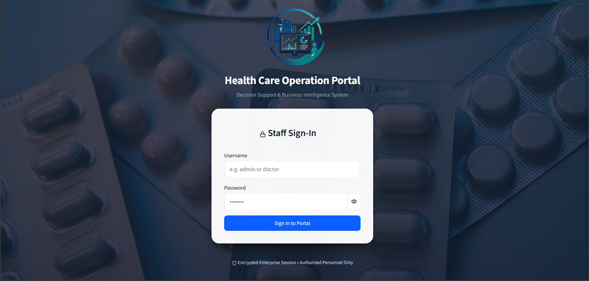
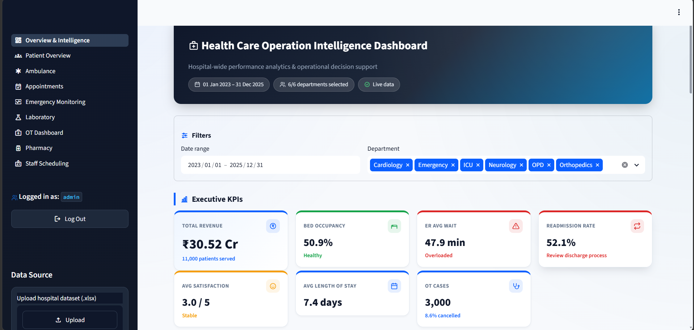
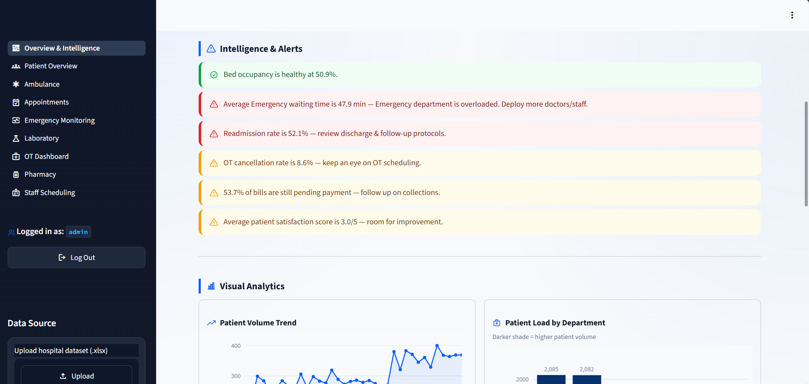

# 🏥 Healthcare Operations Intelligence Dashboard

> A Python and Streamlit-based Business Intelligence & Decision Support System that transforms hospital operational data into actionable KPIs, interactive analytics, operational alerts, and management insights.

[](https://www.python.org/)
[](https://streamlit.io/)
[](https://pandas.pydata.org/)
[](https://plotly.com/)
[](LICENSE.md)

---

## 📸 Product Showcase

> From secure staff access to hospital-wide operational visibility and decision-support intelligence.

### 01 — Secure Staff Access



The application begins with an authenticated staff portal that controls access to hospital operational information.

---

### 02 — Executive Operations Dashboard



The executive dashboard provides a consolidated view of hospital-wide performance through curated KPIs, interactive analytics, operational indicators, and department-level insights.

---

### 03 — Intelligence & Operational Alerts



The intelligence layer converts important operational metrics into plain-language alerts and highlights areas requiring management attention.

---

# 🎯 Why This Project?

Hospitals generate operational data across multiple departments and functions. When this information is distributed across separate datasets or spreadsheets, identifying workload changes, operational bottlenecks, resource utilization, and emerging trends can become difficult.

The **Healthcare Operations Intelligence Dashboard** provides a centralized analytics layer that transforms hospital operational data into:

- 📊 Decision-relevant KPIs
- 📈 Interactive visual analytics
- 🚨 Rule-based operational alerts
- 🏥 Department-level insights
- 📄 Management-ready PDF reports

The objective is not simply to display charts, but to create a workflow that helps users move from:

> **Data → Insight → Attention → Decision Support**

---

# 💡 From Data to Decisions

The core architecture follows a simple analytical pipeline:

```text
RAW HOSPITAL DATA
        ↓
DATA LOADING & CLEANING
        ↓
KPI CALCULATION
        ↓
ANALYTICS
        ↓
INTERACTIVE VISUALIZATION
        ↓
ALERT GENERATION
        ↓
DECISION SUPPORT
        ↓
PDF REPORTING
````

The system is designed around four operational questions:

> **What is happening?**

> **Where is attention required?**

> **What operational trend is emerging?**

> **What should management investigate or act upon?**

---

# ⚡ Key Capabilities

| Capability                  | Purpose                                         |
| --------------------------- | ----------------------------------------------- |
| 📊 Executive KPI Monitoring | Hospital-wide operational performance           |
| 🚨 Operational Intelligence | Rule-based attention signals                    |
| 👥 Patient Analytics        | Visits, admissions, demographics & satisfaction |
| 🧪 Laboratory Analytics     | Test volume, revenue & workload                 |
| 💊 Pharmacy Intelligence    | Sales, demand & dispensing trends               |
| 🚑 Ambulance Analytics      | Response, travel & fuel metrics                 |
| 👨‍⚕️ Staff Scheduling      | Workload, overtime & emergency coverage         |
| 📅 Appointment Analytics    | Completion, cancellation & no-show patterns     |
| 🏥 OT Analytics             | Surgery and theatre utilization                 |
| 🚨 Emergency Monitoring     | Emergency volume and seasonal patterns          |
| 📄 PDF Reporting            | Summarized operational reports                  |
| 📂 Dataset Upload           | Support for compatible Excel datasets           |

---

# 📌 Project at a Glance

| Category             | Details                                       |
| -------------------- | --------------------------------------------- |
| **Domain**           | Healthcare Operations & Business Intelligence |
| **Application Type** | Decision Support Dashboard                    |
| **Language**         | Python                                        |
| **Framework**        | Streamlit                                     |
| **Data Processing**  | Pandas, OpenPyXL                              |
| **Visualization**    | Plotly                                        |
| **Reporting**        | ReportLab                                     |
| **Authentication**   | Streamlit Session + Secrets                   |
| **Primary Input**    | Excel / Hospital Operational Dataset          |
| **Primary Output**   | KPIs, Analytics, Alerts & PDF Reports         |
| **License**          | MIT                                           |

---

# 📊 Dashboard Modules

The application is organized into dedicated operational modules. Each module focuses on a limited set of decision-relevant metrics rather than attempting to display every available field in the dataset.

---

## 1. Executive Overview

**Application view:** `Overview.py`

The Executive Overview provides a consolidated view of hospital operations.

### Key capabilities

* Curated executive KPIs
* Operational alerts
* Patient trends
* Revenue trends
* Department performance
* Interactive visualizations
* Dataset upload
* Decision-support insights
* PDF report generation

### Primary question

> **What is happening across hospital operations, and where should management focus attention?**

---

## 2. Patient Overview

**Data source:** `Hospital_Visits`

### Key analytics

* Patient demographics
* Hospital visits
* Admissions
* Billing information
* Patient satisfaction
* Operational trends

---

## 3. Laboratory Analytics

**Data source:** `laboratory data`

### Key analytics

* Laboratory test volume
* Revenue
* Test category distribution
* Technician workload
* Laboratory performance
* Testing trends

---

## 4. Pharmacy Intelligence

**Data source:** `pharmacy data`

### Key analytics

* Pharmacy sales
* Medicine categories
* Branch performance
* Medicine demand
* Dispensing trends
* Demand intelligence

### Data Limitation: Stock Visibility

The source dataset does **not** contain a live `stock-on-hand` field.

Therefore, the dashboard does not present a fabricated inventory count.

Instead, **medicine dispensing velocity is used as a practical demand indicator/proxy** to identify fast-moving medicines and support demand monitoring and potential reorder decisions.

> This distinction is intentional: the system only presents inventory insights that can be supported by the available dataset.

---

## 5. Ambulance Analytics

**Data source:** `Ambulance_Transportation`

### Key analytics

* Ambulance response time
* Travel time
* Fuel cost
* Driver workload
* Transportation trends

---

## 6. Staff Scheduling

**Data source:** `Staff_Scheduling`

### Key analytics

* Staff workload
* Leave rate
* Overtime
* Duty types
* Emergency coverage
* Scheduling trends

---

## 7. Appointment Analytics

**Data source:** `Appointments`

### Key analytics

* Completed appointments
* Cancelled appointments
* No-show rate
* Peak appointment hours
* Appointment trends

---

## 8. Operation Theatre Dashboard

**Data source:** `OT_Dashboard`

### Key analytics

* Surgery status
* Operation theatre utilization
* Room utilization
* Surgeon workload
* Surgery trends

---

## 9. Emergency Monitoring

**Data source:** `ER_Monitoring_Summary`

### Key analytics

* Emergency case trends
* Monthly emergency volume
* Emergency categories
* Seasonal patterns
* Heatmap-based analysis

---

# 🧠 Decision Intelligence Engine

The centralized KPI and alert logic is implemented through:

```text
utils/kpi.py
```

The module handles:

* KPI calculations
* Threshold evaluation
* Performance indicators
* Operational alerts
* Trend interpretation
* Decision-support rules

## Decision-support flow

```text
Metric
  ↓
KPI Calculation
  ↓
Threshold / Trend Evaluation
  ↓
Alert Classification
  ↓
Plain-Language Insight
```

### Example operational alerts

```text
Bed occupancy is at 92% — prepare additional beds.

Appointment no-show rate is increasing —
review appointment confirmation procedures.

Emergency cases are increasing —
consider additional emergency coverage.

Medicine dispensing velocity is high —
monitor demand and reorder requirements.
```

The actual alerts are generated dynamically according to the underlying dataset and configured KPI rules.

---

## KPI Design Philosophy

Each dashboard module intentionally focuses on approximately **5–7 decision-relevant KPIs**.

The interface combines:

* One visually emphasized hero KPI
* Supporting operational KPIs
* Interactive charts
* Contextual alerts
* Plain-language insights

This approach is intended to reduce information overload and make important operational signals easier to identify.

---

# 🎨 Design System

The application uses a centralized styling architecture:

```text
utils/styling.py
```

This maintains a consistent visual language across dashboard modules.

### Design principles

* Consistent KPI cards
* Alert cards
* Gradient page headers
* Standardized typography and spacing
* Interactive chart containers
* Consistent filter bars
* Highlighted decision-relevant values
* Responsive dashboard layouts
* Consistent application background

### Visualization philosophy

Charts are designed to emphasize decision-relevant information rather than presenting a wall of identical visual elements.

Important values can be highlighted to help users identify:

* Highest and lowest values
* Operational bottlenecks
* Increasing demand
* Resource pressure
* Important trends

---

# 🔐 Security & Access Control

The dashboard includes authentication to restrict access to hospital operational information.

## Authentication flow

```text
Home.py
   ↓
Login Interface
   ↓
Session Authentication
   ↓
Access Validation
   ↓
Dashboard Navigation
```

Authentication is implemented through:

```text
Home.py
utils/auth.py
.streamlit/secrets.toml
```

`Home.py` handles the login interface, while `utils/auth.py` provides access protection for dashboard pages.

This helps prevent users from bypassing the login interface by directly opening internal dashboard pages.

---

## 🔑 Credential Management

Credentials are stored outside the application source code using:

```text
.streamlit/secrets.toml
```

The repository should contain only the example configuration:

```text
.streamlit/secrets.toml.example
```

Real credentials must never be committed to GitHub.

### Local demonstration

Configure the credentials required by the application in:

```text
.streamlit/secrets.toml
```

> ⚠️ Do not use demonstration credentials for a real healthcare deployment.

---

## Production Security Note

This project should be considered a **development/academic decision-support application**, not a production hospital information system.

A real healthcare deployment would require additional controls such as:

* Strong identity and access management
* Role-based permissions
* Encryption
* Secure session management
* Audit logging
* Infrastructure security
* Data privacy controls
* Applicable healthcare and privacy compliance requirements

---

# 📄 PDF Reporting

The project includes a dedicated PDF reporting module:

```text
utils/pdf_generator.py
```

The dashboard can generate summarized operational reports containing important metrics and insights.

Potential uses include:

* Management reporting
* Operational review meetings
* Decision-support summaries
* Offline analysis
* Documentation of dashboard findings

---

# 📂 Dataset

The project uses a bundled sample hospital dataset:

```text
data/Hospital_Dataset_Complete_Project.xlsx
```

## Expected worksheets

The application expects the following worksheet names:

```text
Hospital_Visits
laboratory data
pharmacy data
Ambulance_Transportation
Staff_Scheduling
Appointments
OT_Dashboard
ER_Monitoring_Summary
```

## Dataset usage

### Bundled Dataset

The included Excel workbook can be loaded automatically from the `data/` directory.

### Custom Dataset

Users can upload another workbook through the dashboard.

No application code changes are required as long as the replacement workbook follows the expected worksheet and column structure.

> The dashboard's analytical results are dependent on the quality, completeness, and structure of the supplied dataset.

---

# 🏗️ Project Architecture

The application follows a modular structure separating application entry, authentication, data processing, KPI logic, reporting, styling, and dashboard views.

```text
Healthcare-Operations-Intelligence-Dashboard/
│
├── Home.py
├── logo.png
├── README.md
├── requirements.txt
├── LICENSE.md
│
├── data/
│   └── Hospital_Dataset_Complete_Project.xlsx
│
├── utils/
│   ├── __init__.py
│   ├── auth.py
│   ├── data_loader.py
│   ├── kpi.py
│   ├── pdf_generator.py
│   └── styling.py
│
├── views/
│   ├── Overview.py
│   ├── Patient_Overview.py
│   ├── Laboratory.py
│   ├── Pharmacy.py
│   ├── Ambulance.py
│   ├── Staff_Scheduling.py
│   ├── Appointments.py
│   ├── OT_Dashboard.py
│   └── Emergency_Monitoring.py
│
└── .streamlit/
    ├── config.toml
    └── secrets.toml.example
```

### Core responsibilities

| Component                | Responsibility                                  |
| ------------------------ | ----------------------------------------------- |
| `Home.py`                | Application entry point and authentication flow |
| `utils/auth.py`          | Authentication and page access protection       |
| `utils/data_loader.py`   | Dataset loading and cleaning                    |
| `utils/kpi.py`           | KPI calculations and decision-support rules     |
| `utils/pdf_generator.py` | PDF report generation                           |
| `utils/styling.py`       | Centralized dashboard styling                   |
| `views/`                 | Individual operational dashboard modules        |
| `data/`                  | Bundled sample hospital dataset                 |

> `.streamlit/secrets.toml` is a local configuration file and should not be committed to the repository.

---

# 🛠️ Technology Stack

| Technology       | Purpose                                   |
| ---------------- | ----------------------------------------- |
| **Python**       | Core programming language                 |
| **Streamlit**    | Interactive dashboard and web application |
| **Pandas**       | Data loading, cleaning and analysis       |
| **Plotly**       | Interactive data visualization            |
| **OpenPyXL**     | Excel workbook processing                 |
| **ReportLab**    | PDF report generation                     |
| **Git & GitHub** | Version control and project hosting       |

---

# ⚙️ Installation

## Requirements

* Python **3.10+**
* pip
* Git

---

## 1. Clone the Repository

```bash
git clone https://github.com/kartik-bawne/Healthcare-Operations-Intelligence-Dashboard.git
```

Move into the project directory:

```bash
cd Healthcare-Operations-Intelligence-Dashboard
```

---

## 2. Create a Virtual Environment

### Windows

```bash
python -m venv venv
```

Activate:

```bash
venv\Scripts\activate
```

### Linux / macOS

```bash
python3 -m venv venv
```

Activate:

```bash
source venv/bin/activate
```

---

## 3. Install Dependencies

```bash
pip install -r requirements.txt
```

---

# 🔑 Configure Credentials

Create the local secrets file from the provided example.

### Windows

```bash
copy .streamlit\secrets.toml.example .streamlit\secrets.toml
```

### Linux / macOS

```bash
cp .streamlit/secrets.toml.example .streamlit/secrets.toml
```

Then edit:

```text
.streamlit/secrets.toml
```

and configure the credentials required by the application.

> ⚠️ Never commit `.streamlit/secrets.toml` to GitHub.

---

# ▶️ Run the Application

Start the Streamlit application:

```bash
streamlit run Home.py
```

The application will normally be available at:

```text
http://localhost:8501
```

After opening the application, sign in using the credentials configured in `.streamlit/secrets.toml`.

---

# ☁️ Deployment

The application can be deployed on **Streamlit Community Cloud** or another platform capable of running Streamlit applications.

## Streamlit Community Cloud

1. Push the repository to GitHub.
2. Open Streamlit Community Cloud.
3. Select **New App**.
4. Select this repository.
5. Select the required branch.
6. Set the main file to:

```text
Home.py
```

7. Configure the required credentials under **Settings → Secrets**.
8. Deploy the application.

Dependencies are installed using:

```text
requirements.txt
```

> ⚠️ Do not upload or commit your local `.streamlit/secrets.toml`.

---

# 🔒 Repository Security

The following local or sensitive files should not be committed:

```text
venv/
.venv/
__pycache__/
*.pyc
.env
.streamlit/secrets.toml
```

Only the example configuration should be committed:

```text
.streamlit/secrets.toml.example
```

Never commit:

* Passwords
* API keys
* Authentication tokens
* Database credentials
* Private keys
* Other sensitive information

If real credentials are accidentally pushed to GitHub, they should be considered compromised and rotated immediately.

---

# 🧪 Troubleshooting

| Problem                     | Solution                                             |
| --------------------------- | ---------------------------------------------------- |
| `ModuleNotFoundError`       | Run `pip install -r requirements.txt`                |
| Login fails                 | Check `.streamlit/secrets.toml`                      |
| Dataset not loading         | Verify the Excel file and worksheet names            |
| Blank/old data after upload | Refresh the browser                                  |
| Port already in use         | Run `streamlit run Home.py --server.port 8502`       |
| No dataset loaded yet       | Open the Overview page first                         |
| PDF generation error        | Verify PDF dependencies are installed                |
| Streamlit deployment fails  | Check `requirements.txt` and Streamlit Cloud Secrets |

---

# 🚀 Future Scope

The current system provides an interactive analytics and decision-support foundation.

The following capabilities are **proposed future enhancements** and are not part of the current implementation.

## Data & Infrastructure

* Real-time hospital database integration
* Cloud database connectivity
* Automated ETL pipelines
* API-based data ingestion
* Real-time hospital IoT integration

## Predictive Analytics

* Patient admission forecasting
* Emergency demand prediction
* Medicine demand forecasting
* Staff requirement prediction
* Advanced anomaly detection
* Predictive operational analytics
* Machine-learning-based decision support

## Security & Access

* Role-based access control
* Department-level permissions
* Advanced audit logging
* Enterprise authentication

## Automation

* Automated email reports
* Scheduled management reports
* Automated operational alerts
* Predictive alerting

---

# 📑 Project Documentation

## Project Presentation

The complete project presentation is available here:

[📥 View / Download Project Presentation](docs/Development%20of%20a%20Healthcare%20Operations%20Intelligence%20Dashboard%20with%20Decision%20Analytics%20Group%201.pdf)

## Project Report

The complete project report is available here:

[📄 View / Download Project Report](docs/Healthcare_Intelligence_Report.pdf)

---

# 📜 License

This project is licensed under the **MIT License**.

See [`LICENSE.md`](LICENSE.md) for details.

---

# 👨‍💻 Author

**Kartik Bawne**

Healthcare Operations Intelligence Dashboard

Built with:

**Python • Streamlit • Pandas • Plotly • OpenPyXL • ReportLab**

---

> **Healthcare Operations • Business Intelligence • Decision Analytics • Data Visualization • Operational Intelligence**

```
```
